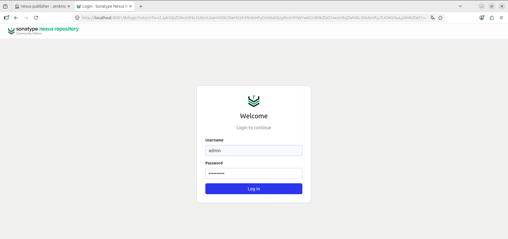
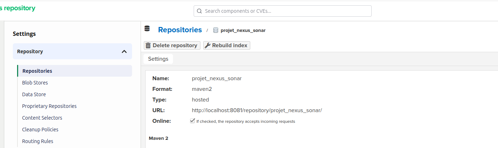
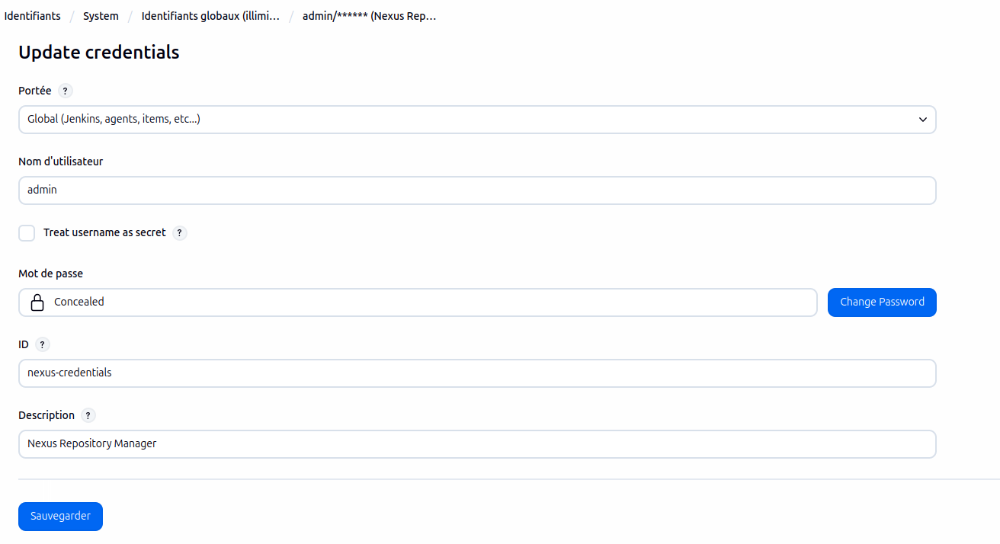
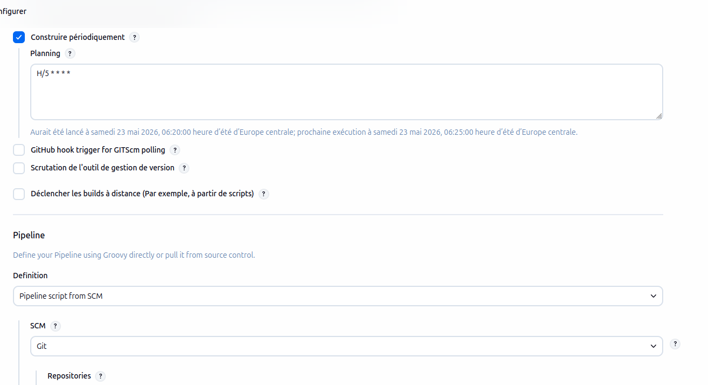
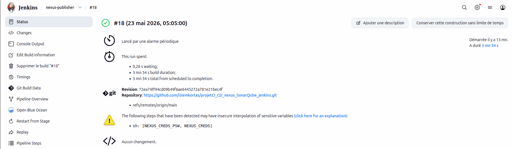
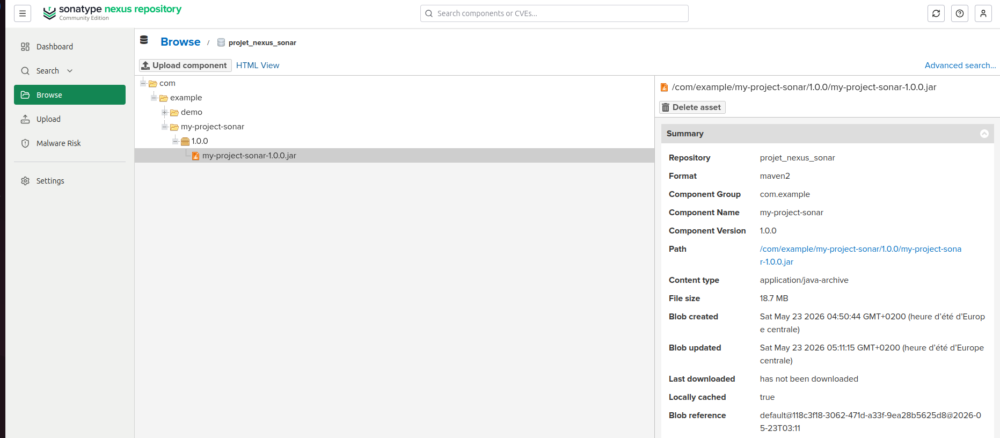
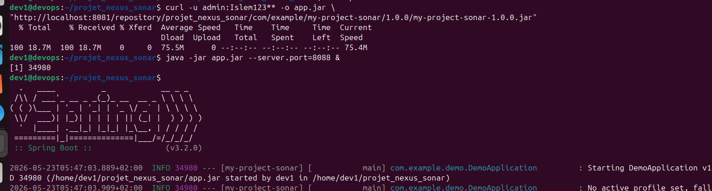

# LAB_NEXUS

## 1. Besoin métier

Dans ce projet, Nexus sert à stocker les artéfacts générés par Jenkins.  
L’objectif est d’avoir un dépôt privé, sécurisé et bien organisé pour publier, retrouver et réutiliser facilement les livrables.

Dans un contexte réel, cela évite de garder les fichiers seulement sur la machine de build.  
On garde une trace claire des versions publiées, et on peut contrôler qui a le droit d’envoyer ou de télécharger un artéfact.

## 2. Concepts

- **Hosted** : dépôt interne utilisé pour publier nos propres fichiers.
- **Proxy** : dépôt cache qui récupère les dépendances externes.
- **Group** : dépôt virtuel qui regroupe plusieurs dépôts sous une seule URL.

Dans ce lab, on utilise un repository Maven hosted pour recevoir le fichier `.jar` produit par Jenkins.  
La structure Maven attend une organisation du type :

`groupId/artifactId/version/fichier.jar`

Cette logique est importante, car Nexus s’appuie sur ce format pour classer correctement les composants publiés .

## 3. Architecture


GitHub → Jenkins B → Nexus

Jenkins B récupère le code source, lance le build, puis publie automatiquement le `.jar` dans Nexus si le build est réussi.  
Nexus joue ici le rôle de dépôt final pour conserver l’artéfact de manière propre et consultable.

## 4. Mise en place technique

### 4.1 Installation

Pour lancer Nexus localement, j’ai utilisé Docker :

```bash
docker run -d -p 8081:8081 --name nexus sonatype/nexus3
```

Après le premier démarrage, le mot de passe administrateur est récupéré avec :

```bash
docker exec nexus cat /nexus-data/admin.password
```

### 4.2 Création du dépôt

Dans l’interface Nexus, j’ai créé un dépôt :

- **Type** : `maven2 (hosted)`
- **Name** : `projet_nexus_sonar`
- **Version policy** : `Release`
- **Deployment policy** : `Allow redeploy`

Ce dépôt est celui qui reçoit l’artéfact généré par Jenkins.  
Le choix de `hosted` est logique ici, car on veut publier nos propres fichiers dans un espace contrôlé.

### 4.3 Credential Jenkins

Dans Jenkins B, j’ai ajouté un credential :

- **ID** : `nexus-credentials`
- **Username** : `admin` ou `jenkins-publisher`
- **Password** : mot de passe Nexus



Ce credential permet à Jenkins de s’authentifier sans écrire les identifiants directement dans le code du pipeline.

### 4.4 Jenkinsfile

```groovy
pipeline {
    agent any

    tools {
        maven 'Maven-3'
    }

    environment {
        NEXUS_URL = 'http://192.168.56.20:8081/repository/projet_nexus_sonar/'
    }

    stages {
        stage('Checkout') {
            steps {
                git branch: 'main',
                    url: 'https://github.com/islemkortas/projetCI_CD_nexus_SonarQube_jenkins.git'
            }
        }

        stage('Build') {
            steps {
                dir('backend/my-project-sonar') {
                    sh 'mvn clean compile'
                }
            }
        }

        stage('SonarQube Analysis') {
            when {
                expression { env.JOB_NAME == 'CI-CD-Pipeline' }
            }
            steps {
                withSonarQubeEnv('SonarQube') {
                    dir('backend/my-project-sonar') {
                        sh 'mvn test sonar:sonar -Dsonar.coverage.jacoco.xmlReportPaths=target/site/jacoco/jacoco.xml'
                    }
                }
            }
        }

        stage('Quality Gate') {
            when {
                expression { env.JOB_NAME == 'CI-CD-Pipeline' }
            }
            steps {
                timeout(time: 5, unit: 'MINUTES') {
                    waitForQualityGate abortPipeline: true
                }
            }
        }

        stage('Package') {
            steps {
                dir('backend/my-project-sonar') {
                    sh 'mvn package -DskipTests'
                }
            }
        }

        stage('Publish to Nexus') {
            when {
                expression { env.JOB_NAME == 'nexus-publisher' }
            }
            environment {
                NEXUS_CREDS = credentials('nexus-credentials')
            }
            steps {
                script {
                    sh '''
                        cd backend/my-project-sonar
                        JAR_FILE=$(find target -name "*.jar" -type f | head -1)
                        FILE_PATH="com/example/my-project-sonar/1.0.0/my-project-sonar-1.0.0.jar"

                        curl -v -u ${NEXUS_CREDS_USR}:${NEXUS_CREDS_PSW} \
                        --upload-file ${JAR_FILE} \
                        ${NEXUS_URL}${FILE_PATH}
                    '''
                }
            }
        }
    }

    post {
        success {
            echo 'Pipeline réussi'
        }
        failure {
            echo 'Pipeline échoué'
        }
        always {
            cleanWs()
        }
    }
}
```

Le job `nexus-publisher` est configuré pour se lancer automatiquement grâce à `Poll SCM` avec l’expression `H/5 * * * *`.



## 5. Test et validation

J’ai d’abord testé une publication manuelle avec `curl` :

```bash
curl -u admin:motdepasse \
--upload-file target/my-project-sonar-1.0.0.jar \
"http://localhost:8081/repository/projet_nexus_sonar/com/example/my-project-sonar/1.0.0/my-project-sonar-1.0.0.jar"
```

Le retour attendu est :

```text
HTTP/1.1 201 Created
```

Ensuite, j’ai lancé le job Jenkins B.  
Dans la console, on doit voir :

```text
HTTP/1.1 201 Created
Pipeline réussi !
```


Dans Nexus, l’artéfact apparaît dans :

`Browse → projet_nexus_sonar → com/example/my-project-sonar/1.0.0/ → my-project-sonar-1.0.0.jar`



Enfin, j’ai vérifié que l’application fonctionne avec :

```bash
curl -u admin:Islem123** -o app.jar \
"http://localhost:8081/repository/projet_nexus_sonar/com/example/my-project-sonar/1.0.0/my-project-sonar-1.0.0.jar"

java -jar app.jar --server.port=8088 &
curl http://localhost:8088/hello
```


## 6. Problèmes rencontrés

Pendant le travail, j’ai rencontré quelques difficultés :

- **Mot de passe Nexus perdu** : j’ai recréé le conteneur pour repartir proprement.
- **Erreur 400 Invalid mavenPath** : j’ai corrigé le chemin pour respecter la structure Maven.
- **Credentials mal placés** : j’ai déplacé la configuration dans le bloc concerné du pipeline.

Ces erreurs m’ont permis de mieux comprendre le fonctionnement réel de Nexus et la manière dont Jenkins publie un artéfact.

## 7. Discussion avec l’IA

Les échanges utilisés pour m’aider à comprendre et structurer ce lab sont enregistrés dans :

`https://chatgpt.com/c/6a0dc63f-31dc-83ea-8156-c8e18ba62bb7`
