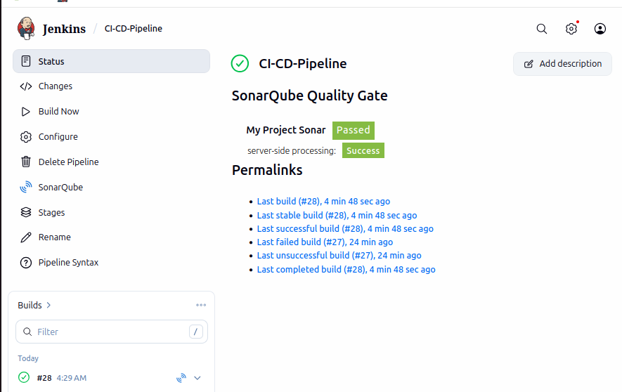
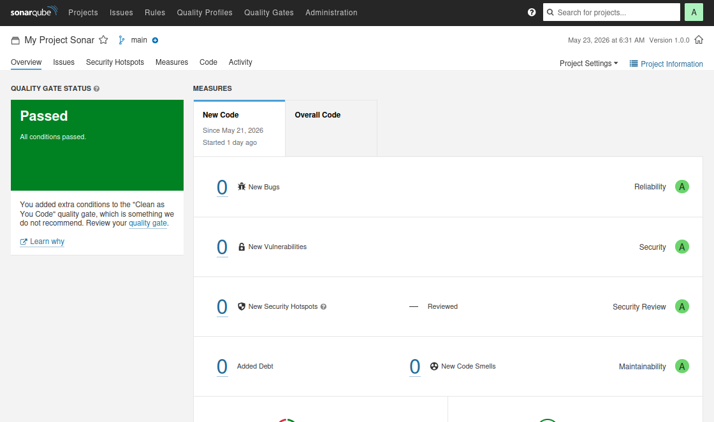
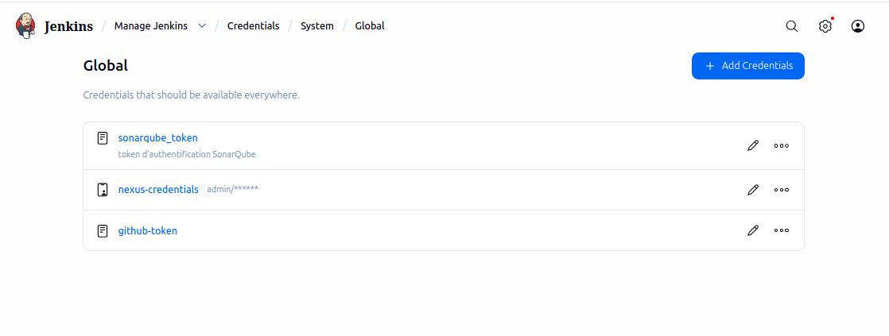
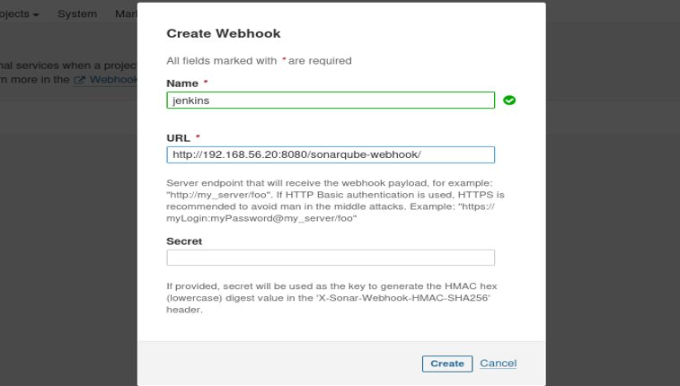

# Projet CI/CD - Jenkins, SonarQube et Nexus

## 1. Présentation du projet
Ce projet met en place une chaîne CI/CD sécurisée utilisant Jenkins, SonarQube et Nexus.  
L’objectif est d’automatiser le build, l’analyse qualité du code, la validation via Quality Gate, puis la publication éventuelle de l’artéfact.

## 2. Objectif
Le but est de montrer comment un pipeline Jenkins peut :
- analyser automatiquement le code ;
- bloquer le build si la qualité est insuffisante ;
- valider le code propre ;
- publier l’artéfact final dans Nexus.

## 3. Architecture utilisée
- Jenkins : orchestration du pipeline.
- SonarQube : analyse de qualité du code.
- Maven : compilation et packaging.
- GitHub : dépôt du code source.
- Nexus : dépôt d’artéfacts.

## 4. Installation des outils
### Jenkins
```bash
docker run -d \
  --name jenkins \
  -p 8080:8080 -p 50000:50000 \
  -v jenkins_home:/var/jenkins_home \
  jenkins/jenkins:lts
```

### SonarQube
```bash
docker run -d \
  --name sonarqube \
  -p 9000:9000 \
  sonarqube:lts
```

## 5. Configuration Jenkins
Les plugins installés sont :
- SonarQube Scanner
- Git Plugin
- Pipeline

Le token SonarQube est ajouté dans les credentials Jenkins.  
Le serveur SonarQube est déclaré dans la configuration système de Jenkins.  
Le webhook SonarQube est configuré pour permettre à Jenkins de récupérer le résultat du Quality Gate .

## 6. Pipeline CI/CD
Le pipeline suit les étapes suivantes :
1. Checkout du code depuis GitHub.
2. Compilation avec Maven.
3. Analyse du code avec SonarQube.
4. Vérification du Quality Gate.
5. Création d’un tag Git si le code est validé.
6. Packaging du projet.
7. Publication dans Nexus si nécessaire.

## 7. Résultats obtenus
### Cas 1 : code non conforme
Lorsque le code contient des erreurs ou une qualité insuffisante, le Quality Gate échoue et Jenkins arrête le pipeline automatiquement.

### Cas 2 : code conforme
Lorsque le code respecte les règles définies, le Quality Gate passe, le pipeline continue, et le build est validé.

## 8. Captures d’écran
Ajouter dans le dépôt :
- Pipeline réussi 

- Résultat du Quality Gate dans SonarQube

- Configuration Jenkins

-Webhook SonarQube

## 9. Conclusion
Ce projet montre comment construire une chaîne CI/CD complète et sécurisée.  
Jenkins automatise le traitement, SonarQube contrôle la qualité du code, et Nexus garde les artéfacts publiés.
